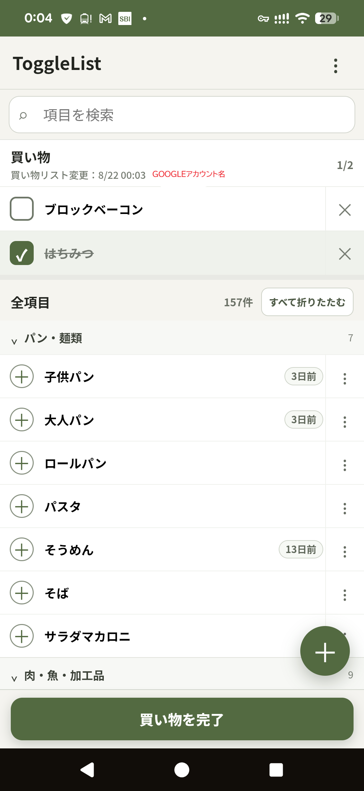

# ToggleList

家族で共有し、繰り返し使える買い物リストのPWAです。商品マスタから必要なものを買い物リストへ追加し、購入済みへの切り替えと買い物完了を複数端末で共有できます。



## 主な機能

- 買い物対象／購入済み／対象外の3状態
- カテゴリ別の商品一覧と、カテゴリ単位／一括での折りたたみ
- 商品の追加・編集・削除、一括追加、並べ替え
- 購入済み商品の一括完了
- 商品ごとの最終購入日を「今日／○日前」で表示
- 変更日時、変更者、買い物操作と買い物完了商品の履歴
- ひらがな／カタカナ、半角／全角を吸収する検索
- 商品ごとの「検索用の読み・別名」
- JSON形式でのデータ書き出し
- インストール可能なPWA
- 新しいバージョンの通知と画面からの更新
- Cloudflare Accessのセッション切れを想定した再ログイン導線

## 体感速度と同期

共有データの正本はCloudflare D1です。端末では次の方法で通信待ちを目立たなくしています。

- 前回の正常取得結果をIndexedDBへ保存
- 2回目以降の起動では前回データを先に表示し、裏側で最新版を取得
- 買い物への追加、購入済み切り替え、取り消し、買い物完了は画面へ即時反映
- 通信失敗時は操作前の状態へ戻してエラーを表示
- 更新中の古い取得結果が楽観的更新を上書きしないよう制御

他端末の変更は、画面表示中は最大約30秒、画面復帰時またはウィンドウ復帰時に取得します。同時更新は最終書き込み優先です。

オフライン変更キューは実装していません。前回データの表示と検索はできますが、変更の保存には通信が必要です。

## 技術構成

- フロントエンド: React 19 + TypeScript + Vite
- PWA: vite-plugin-pwa
- 端末キャッシュ: Dexie / IndexedDB
- API: Cloudflare Workers + Hono
- 共有データベース: Cloudflare D1
- 認証: Cloudflare Access + Google OAuth
- 配信: Cloudflare Workers Static Assets
- 継続デプロイ: GitHub連携のCloudflare Workers Builds

## 必要な環境

- Node.js 24
- npm
- Cloudflareアカウント
- Wranglerで作成したD1データベース

## ローカル起動

Cloudflare WorkerとローカルD1をまとめて起動します。

```powershell
npm.cmd clean-install
npm.cmd run db:migrate:local
npm.cmd run dev:cloudflare
```

表示されたURLを開いてください。空のD1では、初回アクセス時に`src/data/initialData.ts`のサンプル商品を登録します。自分用に構築する場合は、初回起動前にこのファイルを編集できます。

## 品質確認

```powershell
npm.cmd run lint
npm.cmd run build
```

## Cloudflareへの公開

D1作成、マイグレーション、Cloudflare Access、GitHub連携の手順は[CLOUDFLARE_SETUP.md](CLOUDFLARE_SETUP.md)を参照してください。

スキーマ変更を含む場合は、Workerをデプロイする前に本番D1へ未適用マイグレーションを適用します。

## PWAの更新

Service Workerは、画面復帰時と表示中30分ごとに更新を確認します。新しいバージョンを検出すると画面に通知し、「更新する」を押すと最新版へ切り替わります。

## 再ログイン

Cloudflare Accessのセッション切れが疑われる場合は、同期エラーとともに「再ログイン」を表示します。通常の通信エラーの可能性もあるため、「再試行」も選べます。

## データ保持

Workerやフロントエンドを再デプロイしても、同じD1を参照している限り、買い物リストと変更履歴は保持されます。端末内IndexedDBは表示を速めるためのキャッシュであり、共有データの正本ではありません。

## セキュリティ

- 本番URLとプレビューURLの両方をCloudflare Accessで保護してください。
- D1には利用者のメールアドレスが変更者情報として保存されます。
- JSON書き出しデータには商品名、メモ、更新者などが含まれるため、取り扱いに注意してください。
- 公開リポジトリへ実データ、ログ、認証情報、個人用の初期商品名をコミットしないでください。

## ライセンス

[MIT License](LICENSE)
